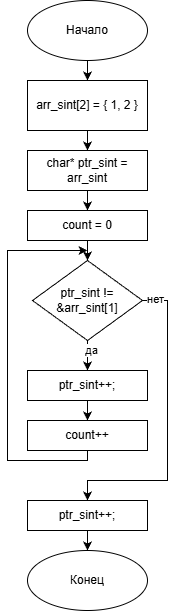

# Домашнее задание
Напишите программу, которая вычисляет размер основных типов данных в байтах
## Условие задачи


## 1. Алгоритм и блок-схема

### Алгоритм
1. **Начало**
2. Для каждого типа данных:
   - Создать массив из 2 элементов заданного типа
   - Создать указатель типа `char*`, указывающий на начало массива
   - Инициализировать счетчик `count = 0`
3. Перемещать указатель на 1 байт до тех пор, пока он не достигнет адреса второго элемента массива:
   - Увеличивать указатель: `ptr++`
   - Увеличивать счетчик: `count++`
4. Вернуть значение счетчика, которое равно размеру типа данных в байтах
5. Вывести результаты для всех типов данных
6. **Конец**

### Блок-схема


[https://github.com/glebofrl/lab12VSTU/blob/master/scheme.png](https://github.com/glebofrl/lab12VSTU/blob/master/scheme.png)

## 2. Реализация программы

```
#include <locale.h>
#include <stdio.h>

void main() {
	
	printf("char %d\n",ptr_char());
	printf("short int %d\n", ptr_sint());
	printf("unsigned short int %d\n", ptr_usint());
	printf("int %d\n", ptr_int());
	printf("unsigned char %d\n", ptr_uchar());
	printf("wchar_t %d\n", ptr_wchar_t());
	printf("long long int %d\n", ptr_llint());
	printf("size_t %d\n", ptr_size_t());
	printf("float %d\n", ptr_float());
	printf("double %d\n", ptr_double());
	printf("signed int %d\n", ptr_signed_int());
}

int ptr_char() {
	char arr_ch[2] = { 'a', 'b' };
	char* ptr_ch = arr_ch;
	int count = 0;

	for (int i = 0; ptr_ch != &arr_ch[1]; i++) {
		ptr_ch++;
		count++;
	}

	return count;
}

int ptr_sint() {
	short int arr_sint[2] = { 1, 2 };
	char* ptr_sint = arr_sint;
	int count = 0;

	while (ptr_sint != &arr_sint[1]) {
		ptr_sint++;
		count++;
	}

	return count;
}

int ptr_usint() {
	unsigned short int arr_usint[2] = { 1, 2 };
	char* ptr_usint = arr_usint;
	int count = 0;

	for (int i = 0; ptr_usint != &arr_usint[1]; i++) {
		ptr_usint++;
		count++;
	}

	return count;
}

int ptr_int() {
	int arr_int[2] = { 1, 2 };
	char* ptr_int = arr_int;
	int count = 0;

	for (int i = 0; ptr_int != &arr_int[1]; i++) {
		ptr_int++;
		count++;
	}

	return count;
}

int ptr_uchar() {
	unsigned char arr_ch[2] = { 'a', 'b' };
	char* ptr_ch = arr_ch;
	int count = 0;

	for (int i = 0; ptr_ch != &arr_ch[1]; i++) {
		ptr_ch++;
		count++;
	}

	return count;
}

int ptr_wchar_t() {
	wchar_t arr_ch[2] = { 'a', 'b' };
	char* ptr_ch = arr_ch;
	int count = 0;

	for (int i = 0; ptr_ch != &arr_ch[1]; i++) {
		ptr_ch++;
		count++;
	}

	return count;
}

int ptr_llint() {
	long long int arr_llint[2] = { 1, 2 };
	char* ptr_ch = arr_llint;
	int count = 0;

	for (int i = 0; ptr_ch != &arr_llint[1]; i++) {
		ptr_ch++;
		count++;
	}

	return count;
}

int ptr_size_t() {
	size_t arr_st[2] = { 1, 2 };
	char* ptr_ch = arr_st;
	int count = 0;

	for (int i = 0; ptr_ch != &arr_st[1]; i++) {
		ptr_ch++;
		count++;
	}

	return count;
}

int ptr_float() {
	float arr_f[2] = { 1, 2 };
	char* ptr_ch = arr_f;
	int count = 0;

	for (int i = 0; ptr_ch != &arr_f[1]; i++) {
		ptr_ch++;
		count++;
	}

	return count;
}

int ptr_double() {
	double arr_d[2] = { 1, 2 };
	char* ptr_ch = arr_d;
	int count = 0;

	for (int i = 0; ptr_ch != &arr_d[1]; i++) {
		ptr_ch++;
		count++;
	}

	return count;
}

int ptr_signed_int() {
	signed int arr_siint[2] = { 1, 2 };
	char* ptr_ch = arr_siint;
	int count = 0;

	for (int i = 0; ptr_ch != &arr_siint[1]; i++) {
		ptr_ch++;
		count++;
	}

	return count;
}
```

## 3. Результаты работы программы


## 4. Информация о разработчике

Глебов Илья, бИПТ-252
